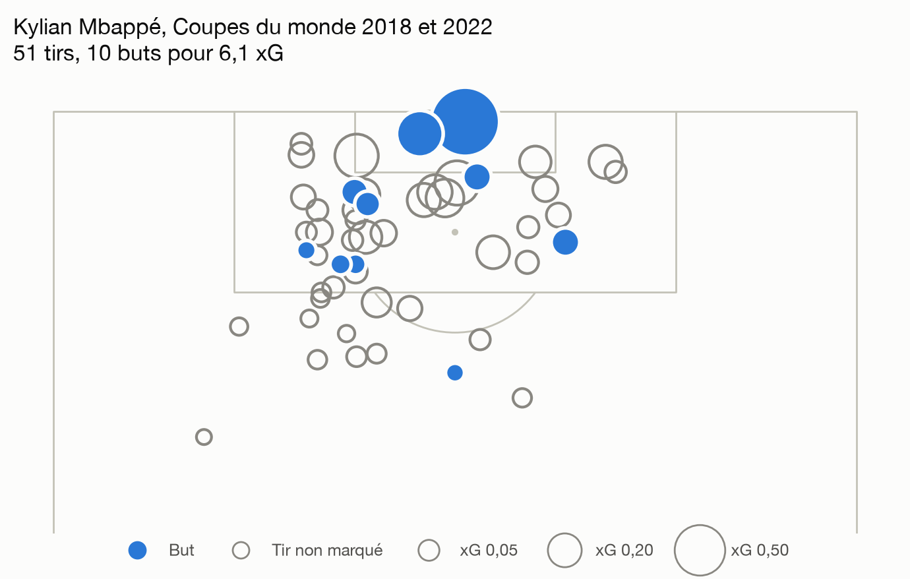
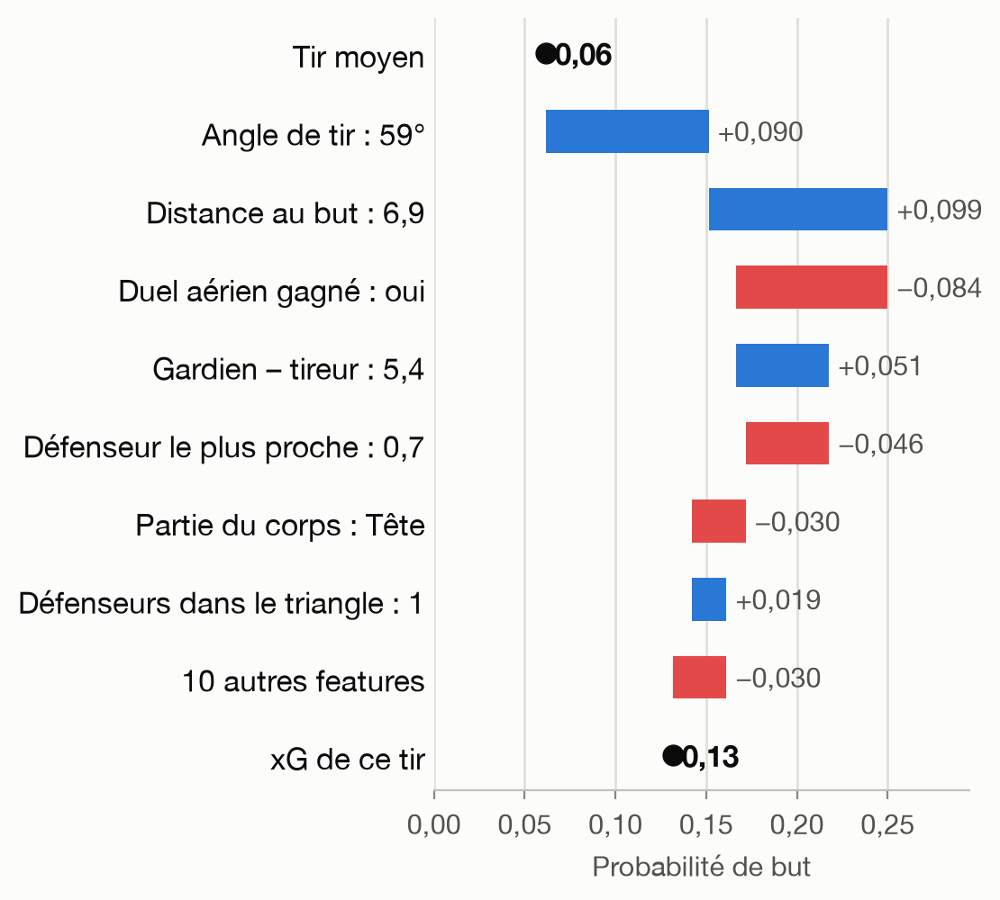

# Modèle d'expected goals (xG)

Quelle est la probabilité qu'un tir finisse au fond ? Ce projet construit un
modèle d'expected goals à partir des données ouvertes de StatsBomb (5 583 tirs
de Coupe du monde et d'Euro), le compare à l'xG officiel de StatsBomb, et le
rend explorable dans une application Streamlit.


*Les trois modèles sont calibrés : parmi les tirs auxquels ils donnent 0,15,
environ 15 % finissent au fond. Barres : intervalles à 95 % sur 1 362 tirs de test.*

Le [rapport](rapport/rapport.pdf) explique pas à pas la démarche et chaque
notion, sans prérequis. Ce README présente les résultats et sert à faire
tourner le code.

## Résultats

Évaluation sur 1 362 tirs de 57 matchs jamais vus pendant l'entraînement.

| Modèle | Log loss ↓ | Brier ↓ | ROC AUC ↑ |
| --- | --- | --- | --- |
| Aucun modèle (taux moyen de buts) | 0,323 | 0,089 | 0,500 |
| Logistique, distance + angle | 0,280 | 0,080 | 0,767 |
| Logistique, 17 features | 0,256 | 0,073 | 0,816 |
| Gradient boosting, 17 features | 0,255 | 0,073 | 0,819 |
| xG StatsBomb | **0,245** | **0,069** | **0,833** |

- **Les features font le travail, pas le modèle.** Passer de 2 à 17 features
  (gardien, passe décisive, défenseurs, phase de jeu…) comble 70 % de l'écart
  avec StatsBomb. Passer de la logistique au gradient boosting n'apporte rien
  de mesurable : écart de −0,001, intervalle bootstrap [−0,006 ; +0,005].
- **L'écart restant avec StatsBomb est faible mais réel** : 0,010 de log loss,
  intervalle [0,000 ; 0,019]. StatsBomb a des centaines de fois plus de tirs.
- **Les features les plus fortes** : l'angle et la distance, puis la passe en
  profondeur, la position du gardien et les défenseurs entre le ballon et le but.
- **Sur-performer son xG, c'est surtout de la chance sur ces tournois.** Parmi
  137 joueurs à 10 tirs ou plus, 7 ont un écart buts − xG que le hasard
  explique dans moins de 5 % des cas ; le hasard seul en produirait environ 4.

## L'application

<p>
  
  
</p>

Trois onglets :

- **Joueurs** : buts, xG et écart de chaque joueur, avec la probabilité que
  l'écart soit dû au hasard et le nombre de joueurs qu'on attendrait sous 5 %
  si tous n'avaient que de la chance.
- **Tirs d'un joueur** : carte de tirs (taille = xG, plein = but). Un clic sur
  un tir montre ce que chaque feature a ajouté ou retiré à son xG, en partant
  du tir moyen (valeurs SHAP).
- **Le modèle** : métriques et calibration.

Tous les xG affichés sont des prédictions hors-pli : chaque tir est jugé par un
modèle qui n'a pas vu son match.

## Démarrage

```bash
git clone https://github.com/nabil-belguebli/01-xg-model.git && cd 01-xg-model
python3 -m venv .venv && source .venv/bin/activate
pip install -r requirements.txt

python -m pytest tests                 # 21 tests
python src/dataset.py                  # télécharge et met en cache les données, ~10 min la première fois
python src/train.py                    # logistique, feature par feature
python src/boosting.py                 # gradient boosting, une à deux minutes
python src/figures.py                  # figures/
python src/app_data.py                 # prépare les données de l'application
streamlit run src/app.py
```

`python src/dataset.py --limit 5` fait un essai rapide sur 5 matchs par compétition.
Le téléchargement fait un appel HTTP par match ; tout est mis en cache dans
`data/raw/`, la deuxième exécution est instantanée.

Le rapport se recompile avec `python rapport/build.py` (paquet `typst`).

## Organisation du code

| Fichier | Rôle |
| --- | --- |
| `src/statsbomb.py` | Téléchargement et cache des JSON StatsBomb ; associe chaque tir à sa passe décisive |
| `src/features.py` | Tir → features : distance, angle, défenseurs dans le triangle, gardien, défenseur le plus proche, passe décisive |
| `src/dataset.py` | Parcourt les matchs, écrit `data/shots.csv` |
| `src/train.py` | Logistique enrichie feature par feature, régularisation par validation croisée, xG hors-pli |
| `src/boosting.py` | Gradient boosting réglé par validation croisée, bootstrap par match |
| `src/explain.py` | Contribution de chaque feature à chaque xG (valeurs SHAP exactes de la logistique) |
| `src/overperformance.py` | Probabilité qu'un écart buts − xG soit dû au hasard (loi de Poisson-binomiale) |
| `src/figures.py` | Toutes les figures de `figures/` |
| `src/app_data.py`, `src/app.py` | Application Streamlit |
| `tests/` | Géométrie, absence de fuite d'information, cohérence des explications, test du hasard |
| `reports/` | Métriques, calibration, bootstrap et prédictions de test en CSV |

## Les décisions de méthode

**Le découpage train/test se fait par match, pas par tir.** Deux tirs du même
match partagent un contexte. Les séparer ferait fuiter de l'information et
gonflerait les scores sans que rien ne le signale. La validation croisée et le
bootstrap sont groupés par match pour la même raison.

**Aucune information postérieure au tir.** Certains champs StatsBomb décrivent
l'issue (`goal_assist`, `end_location`, `deflected`…). Ils sont écartés, et un
test vérifie qu'une passe décisive est décrite de la même façon que le tir
soit un but ou non.

**L'accuracy n'apparaît nulle part.** Environ 10 % des tirs sont des buts : un
modèle qui répond « jamais but » afficherait 90 %. On mesure le log loss et le
score de Brier, qui jugent les probabilités, et la calibration.

**Les choix se font en validation croisée, jamais sur le test.** Sur le seul
jeu de test, deux ajouts de features semblaient dégrader le modèle ; en
validation croisée, chacun l'améliore. Le test ne sert qu'à la mesure finale.

**Tout écart est accompagné de son incertitude.** Intervalles à 95 % sur la
calibration, bootstrap par match sur les comparaisons de modèles, probabilité
de hasard et fausses alertes attendues sur les joueurs.

## Limites

- 5 583 tirs de quatre tournois : peu pour un modèle d'xG, et des matchs de
  sélections nationales uniquement.
- Pas de hauteur du ballon à la frappe, ni de modélisation fine de la position
  de tous les défenseurs.
- Les annotations « but vide » et « face-à-face » sont des jugements
  d'analystes StatsBomb.
- Les penalties sont exclus du modèle et des bilans de joueurs.

## Données

[StatsBomb Open Data](https://github.com/statsbomb/open-data), libres d'usage
sous réserve de citer StatsBomb. Les données brutes ne sont pas versionnées
dans ce dépôt ; `src/dataset.py` les télécharge.
