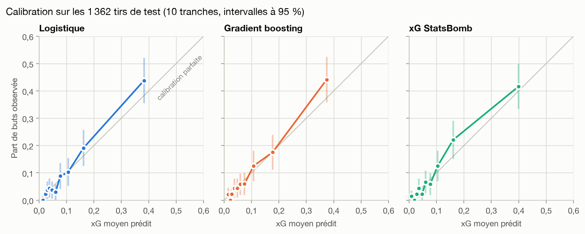

# Modèle d'expected goals (xG)

Estimer la proba que le tir d'un match de football termine au fond du but.
Comparaison avec StatsBomb.

Les notions et les résultats sont expliqués pas à pas dans
[`rapport/rapport.txt`](rapport/rapport.txt). Ce README sert à faire tourner le code.



## Ce qu'il y a dans chaque fichier

| Fichier | Rôle |
| --- | --- |
| `src/statsbomb.py` | Télécharge les JSON du dépôt open-data, les met en cache dans `data/raw/`, associe chaque tir à sa passe décisive |
| `src/features.py` | Distance, angle, défenseurs dans le triangle, gardien, défenseur le plus proche, passe décisive |
| `src/dataset.py` | Parcourt les matchs, aplatit chaque tir en une ligne, écrit `data/shots.csv` |
| `src/train.py` | Logistique enrichie feature par feature, métriques, calibration, comparaison à l'xG StatsBomb |
| `src/boosting.py` | Gradient boosting réglé par validation croisée, bootstrap par match contre la logistique et StatsBomb |
| `src/figures.py` | Calibration, log loss par étape, carte d'xG, carte de tirs d'un joueur, dans `figures/` |
| `src/explain.py` | xG hors-pli de chaque tir et contribution de chaque feature (valeurs SHAP exactes de la logistique) |
| `src/overperformance.py` | Probabilité qu'un écart buts − xG soit dû au hasard, fausses alertes attendues |
| `src/app_data.py` | Prépare `data/app_shots.csv` pour l'application |
| `src/app.py` | Application Streamlit : joueurs, cartes de tirs, explication d'un tir |
| `tests/test_features.py` | Géométrie : une erreur de signe fausse tout sans lever d'exception |
| `tests/test_model.py` | Les contributions retombent sur l'xG, loi du nombre de buts, test du hasard |

## Démarrage

```bash
git clone https://github.com/nabil-belguebli/01-xg-model.git && cd 01-xg-model
python3 -m venv .venv && source .venv/bin/activate
pip install -r requirements.txt

python -m pytest tests                 # 21 tests, doivent passer avant tout le reste
python src/dataset.py --limit 5        # essai rapide : 5 matchs par compétition
python src/dataset.py                  # le jeu complet, compter une dizaine de minutes
python src/train.py                    # logistique, feature par feature
python src/boosting.py                 # gradient boosting, une à deux minutes
python src/figures.py                  # figures/, après train.py et boosting.py
```

Le premier téléchargement complet prend un moment : un appel HTTP par match.
Tout est mis en cache, la deuxième exécution est instantanée.

## L'application

```bash
python src/app_data.py                 # une fois, après dataset.py
streamlit run src/app.py
```

Trois onglets :

- **Joueurs** : buts, xG et écart de chaque joueur, avec la probabilité que
  l'écart soit dû au hasard et le nombre de joueurs qu'on attendrait sous 5 %
  si tous n'avaient que de la chance.
- **Tirs d'un joueur** : carte de tirs ; un clic sur un tir montre ce que
  chaque feature a ajouté ou retiré à son xG.
- **Le modèle** : métriques et calibration.

## Les trois décisions de méthode

**Le découpage train/test se fait par match, pas par tir.** Deux tirs du même
match partagent le contexte. Les séparer ferait fuiter de l'information et
gonflerait le score sans que rien ne le signale.

**L'accuracy n'apparaît nulle part.** Environ 10 % des tirs sont des buts, donc
un modèle qui répond « jamais but » afficherait 90 %. On mesure le log loss et
le score de Brier, qui punissent la confiance mal placée.

**La calibration est le vrai résultat.** Parmi les tirs auxquels le modèle
donne 0,30, il doit y avoir environ 30 % de buts. Un modèle d'xG n'est utile
que dans la mesure où il est calibré — c'est la première figure du README final.

## Le juge de paix

StatsBomb livre son propre xG (`shot_statsbomb_xg`) à côté de chaque tir.
`train.py` évalue les deux sur le même jeu de test. La baseline à deux
variables ne le battra pas, et c'est le point : l'écart mesure ce que
distance et angle ne capturent pas, et justifie les features suivantes.

## Suite de la semaine

- [x] Chargement des données et mise en cache
- [x] Distance, angle, défenseurs dans le triangle (gardien compté comme défenseur)
- [x] Baseline logistique, métriques, calibration
- [x] Features catégorielles : partie du corps, situation de jeu, première intention
- [x] Gradient boosting, comparé à la baseline sur les mêmes métriques
- [x] Features avancées : gardien, passe décisive, phase de jeu ; régularisation par validation croisée
- [x] Figures : calibration, carte de tirs avec mplsoccer
- [x] Application Streamlit : carte de tirs, sur/sous-performance des joueurs, SHAP
- [ ] README final avec la courbe de calibration en première image

## Données

[StatsBomb Open Data](https://github.com/statsbomb/open-data), libres d'usage
sous réserve de citer StatsBomb. Aucune donnée n'est versionnée dans ce dépôt.
